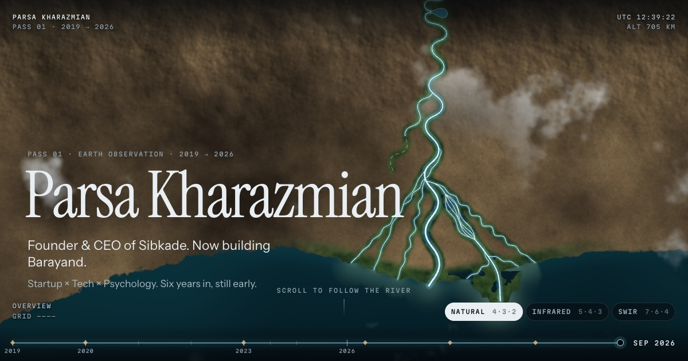
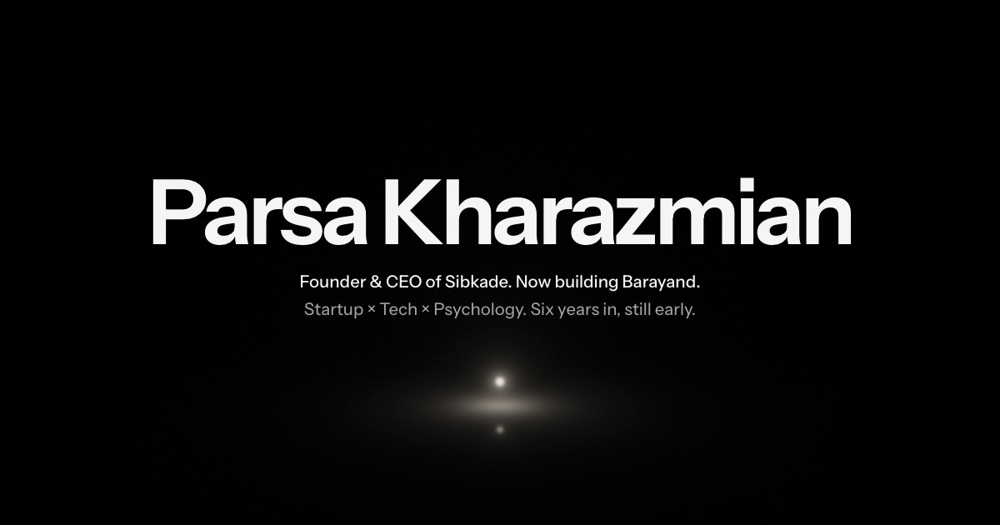

# Delta

The personal site of Parsa Kharazmian, in two versions that share the same words:

- **Delta** (`index.html`): a single satellite pass over one river. The river is grown in code from
  Parsa's timeline: every channel is a real project, and scrolling moves through time from the source
  (2019) to the sea (today), then pulls back to orbit.
- **The Keynote** (`keynote.html`): the portfolio as an Apple keynote. One glass object on a black stage
  changes form with each chapter, and the copy plays as captions under the slides.

<p>
  
  
</p>

Plain HTML, CSS and JavaScript modules, with WebGL for the terrain and the stage. No framework, no
build step, no dependencies, no CDN; the fonts are self-hosted.

## Run it

```bash
npm start            # = python3 dev/serve.py 8137
```

Open http://localhost:8137. ES modules need a server; opening the file directly will not work.
`dev/serve.py` is a plain static server with caching turned off, so every edit shows on reload.
`http://localhost:8137/dev/` is a tuning harness with sliders for time, camera, band and planet.

`?motion=reduce` previews the reduced-motion version (no intro, no drifting clouds, the camera snaps).

## How Delta works

- **The story is data.** `js/story.js` holds calendar anchors, the moments that shape the river,
  the scenes, the gauge stations and the projects.
- **The river is grown from it.** `js/delta.js` builds the channels with a fixed seed, so the river is
  the same on every visit: IranSpoti's meanders and their cutoff into an oxbow lake, Sibkade's main
  stem, HelpFinity splitting off and drying, Mind Mirror refilling its bed, Barayand's braid and lobe,
  and the weekend projects as distributaries at the front.
- **One texture carries the influence of the river.** `js/field.js` bakes moisture, arrival time,
  old channels and the sea into a small RGBA field.
- **One shader paints the ground.** `js/shaders.js` draws soil, relief, wetness spreading over time,
  the sediment plume, clouds and the three Landsat band palettes on one full-screen triangle. The map
  is the surface of a large planet seen from above, so the finale pulls back to orbit in one camera
  move, over the same land.
- **The channels are drawn on top.** `js/overlay.js` strokes them in Canvas 2D and projects them onto
  the same sphere as the terrain. `js/scenes.js` turns scroll into story time and a camera, moved by
  critically damped springs.

## Edit the words

All copy lives in `index.html` and `keynote.html`, verbatim from Parsa's source notes (`content/`,
which stays private and is not in this repository). In Delta each scene is a `<section>` of `.step`
blocks. A step's `data-t0`/`data-t1` is the story time it covers (0 = Jan 2019, 1 = Sep 2026). If you
add or split a step, keep the ranges contiguous. `npm test` checks this.

## Tests

```bash
npm test
```

Node 18+. The suite covers the geometry, the field, time mapping, the Mars clock and the Keynote's
film. It also guards the content: no Persian script may ship, none of the private notes may ship, and
external links are limited to an allowlist. The checks that compare the pages with the private source
notes (every line of copy verbatim, no private figures) are skipped when `content/` is absent, as it
is in this repository.

## Deploy

```bash
npm run dist
```

This copies only the site (`index.html`, `keynote.html`, `css/`, `js/`, `fonts/`, `assets/`) into
`dist/`. Upload the contents of `dist/` to any static host, and nothing else: the tests, the dev tools
and, in the private working copy, the source notes are not part of the site.

## The Keynote

`keynote.html` is the portfolio as an Apple keynote. One glass object on a black stage changes form
with each chapter (a drawn draft, a card, a mirror, a prism, six lights, one light among a thousand),
and all of the copy plays as captions under the slides. Watch plays it as a film of about three
minutes; scrolling plays it at your own pace, and scrolling back rewinds it.

Locally it is at http://localhost:8137/keynote.html. Deployed, it is `/keynote` on hosts with clean
URLs and `/keynote.html` elsewhere. Delta and the Keynote do not link to each other.

- **The words** live in `keynote.html`: chapters are `<section>`s, each paragraph of copy is a
  `.caption` inside a `.beat`, and empty `<span class="cue" data-cue="…">` markers inside a caption cue
  the slides and the object. With the source notes present, `npm test` checks that every caption is
  one paragraph of the copy, verbatim, and that no other words appear beyond the approved list in
  `tests/keynote-page.test.js`.
- **The object's film** is `js/keynote/score.js`: keyframes named after cues (`'s4-vip'`, or `'s4-vip>'`
  for the end of its hold) that change the state. `npm test` fails on a cut (a field that jumps
  between two nearby positions).
- **Checking a frame**: `?cue=<id>` or `?p=<words>` opens at a moment, `?debug` shows the position and
  frame rate, `?motion=reduce` previews reduced motion, `?nowebgl` the fallback without WebGL, `?taa=0`
  turns off temporal anti-aliasing, and `?q=0.5`…`1` pins the render quality.
  `node dev/shoot.mjs <dir> 1440x900@2 name=cue=b1-diverge` takes real-time screenshots in headless
  Chrome (a throwaway profile, never your own); `dev/keynote-stage.html` is a harness with sliders for
  the renderer.

### Making the Keynote the main site

`npm run dist` ships both pages. To swap them, rename `index.html` to `delta.html` and `keynote.html` to
`index.html`, then change the Keynote's canonical and `og:url` to `https://heyparsa.com/` (and Delta's to
`https://heyparsa.com/delta` if it stays online), and update the URL list in
`tests/content-guard.test.js`. Every path is relative and both pages sit at the root, so nothing else
changes.

## Keyboard

`→`/`J` and `←`/`K` jump between sections · `B` cycles bands · the time scrubber takes arrow
keys, Home/End and PageUp/PageDown.

## License

© 2026 Parsa Kharazmian. All rights reserved. The code is here to read and learn from; it is not
licensed for reuse, so please don't redeploy the site, its words or its design as your own.

The fonts are the exception: Instrument Sans, Instrument Serif and Martian Mono are under the SIL Open
Font License 1.1 (see `fonts/OFL.txt`).
